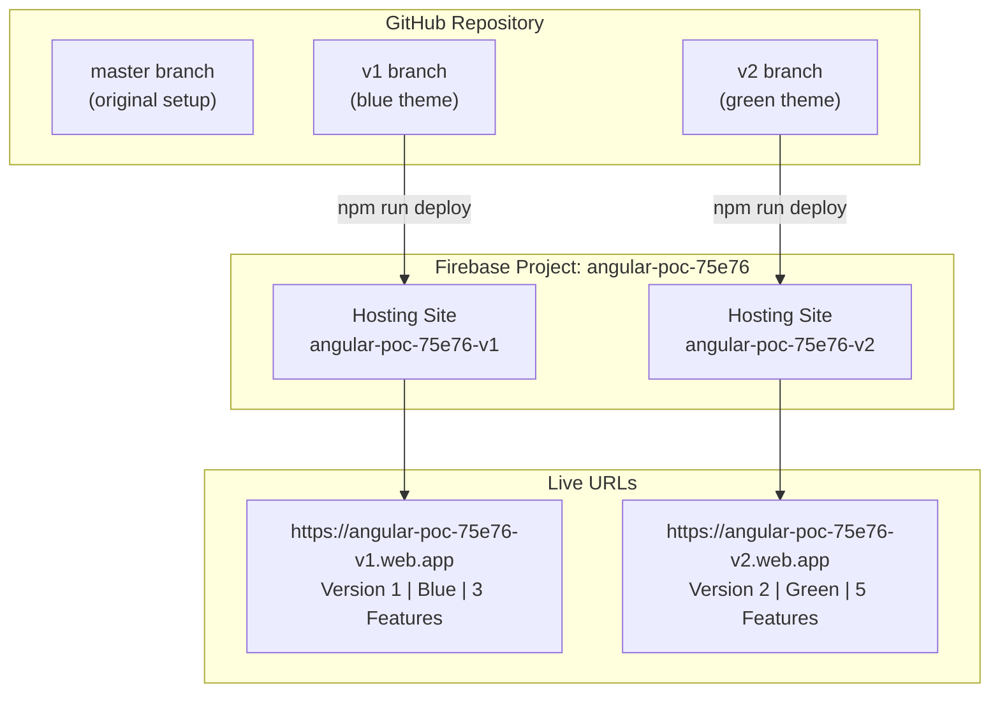
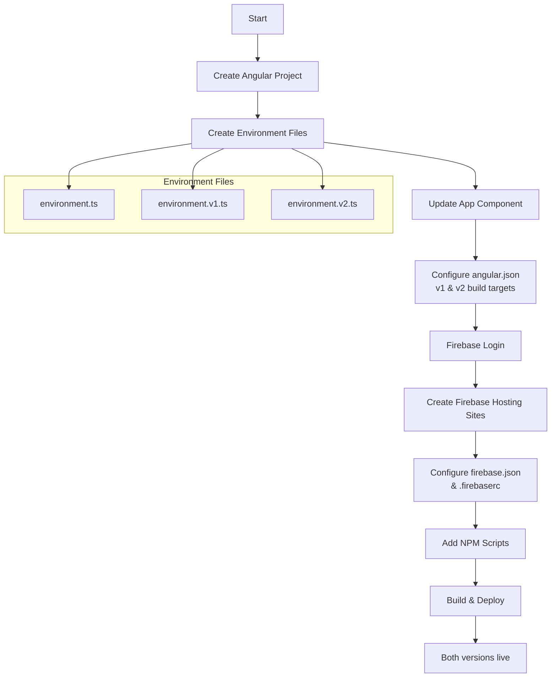
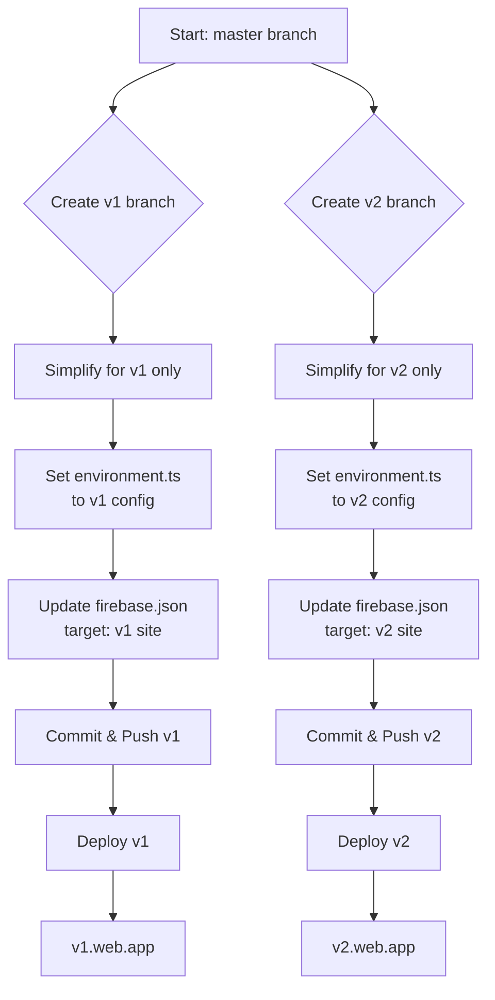
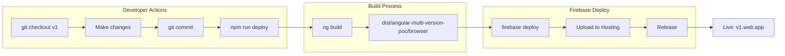
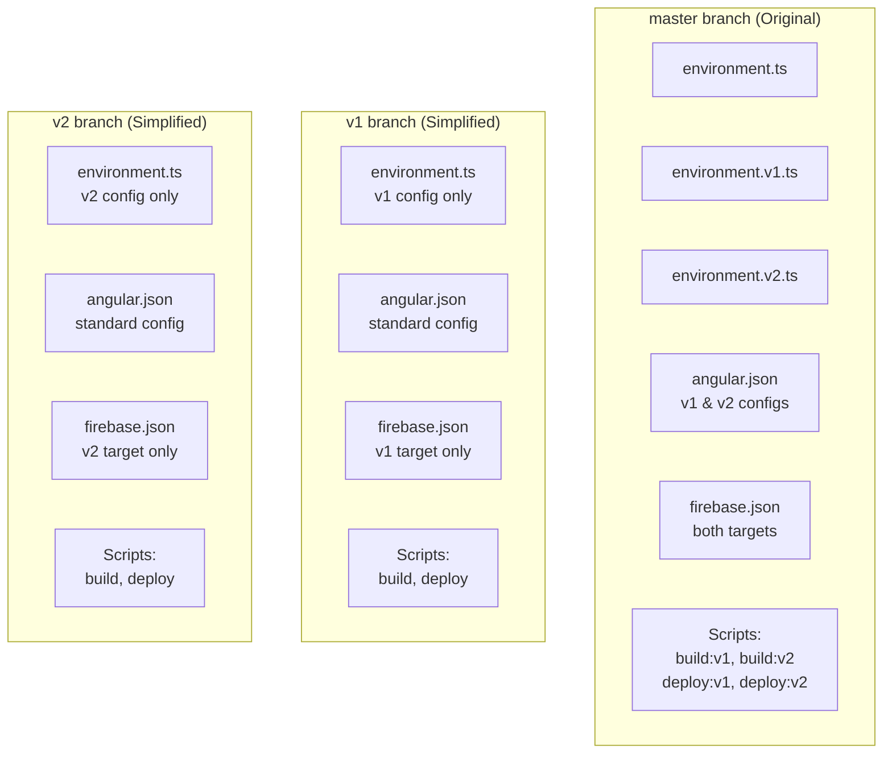
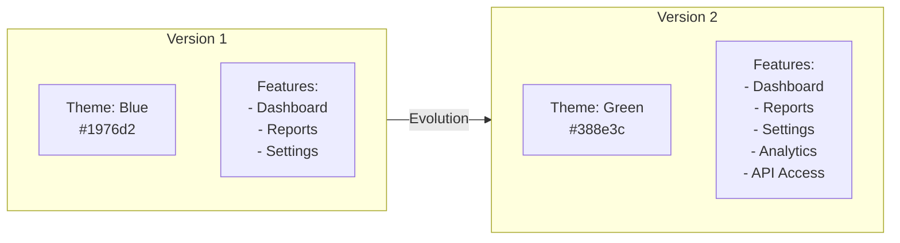
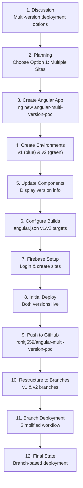

# Angular Multi-Version Firebase Deployment - Flow Diagrams

## 1. Overall Architecture

## 2. Initial Setup Flow

## 3. Branch-Based Deployment Flow

## 4. Deployment Workflow

## 5. Project Structure Comparison

## 6. Version Differences

## 7. Complete Activity Timeline

---

## How to View These Diagrams

1. **GitHub**: These diagrams render automatically when viewing this file on GitHub
2. **VS Code**: Install "Markdown Preview Mermaid Support" extension
3. **Online**: Copy the mermaid code to [mermaid.live](https://mermaid.live)

---

## Quick Reference

| Branch | Command | Result |
|--------|---------|--------|
| v1 | `git checkout v1 && npm run deploy` | Deploys to v1.web.app |
| v2 | `git checkout v2 && npm run deploy` | Deploys to v2.web.app |

---

*Generated by Claude Code on February 2, 2026*
